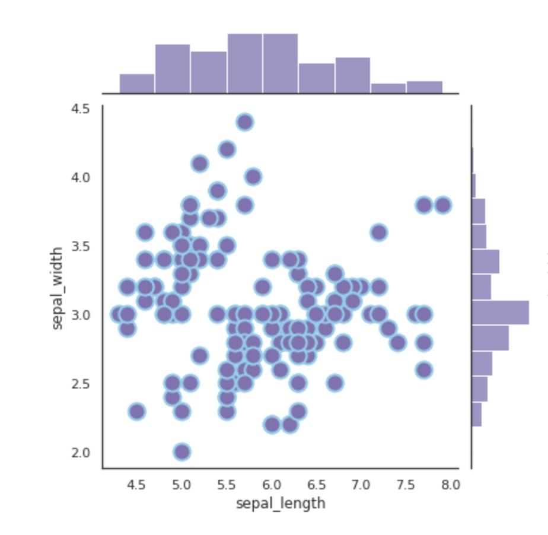

# research_extract

- branch: 2023-dev-yonezawa

&nbsp;

## やることリスト

&nbsp;

### 1. どのような情報を取得するのかを決める(優先)

- メタデータに詳細な記述がない情報を取得したい
- 処理温度､処理時間､処理(incubator, water bath, fieldなど)
- この前ちらっと考えていたこと:処理温度と処理時間の散布図を作りたい
- [Marginal Plot with Seaborn](https://python-graph-gallery.com/82-marginal-plot-with-seaborn/)
- 

&nbsp;

### 2. どのような処理を行うのか

Eーdirectに変更
研究で使うならGPT使わないほうが良い?
どういうattributionが欲しいのか

確認できました。ありがとうございます。