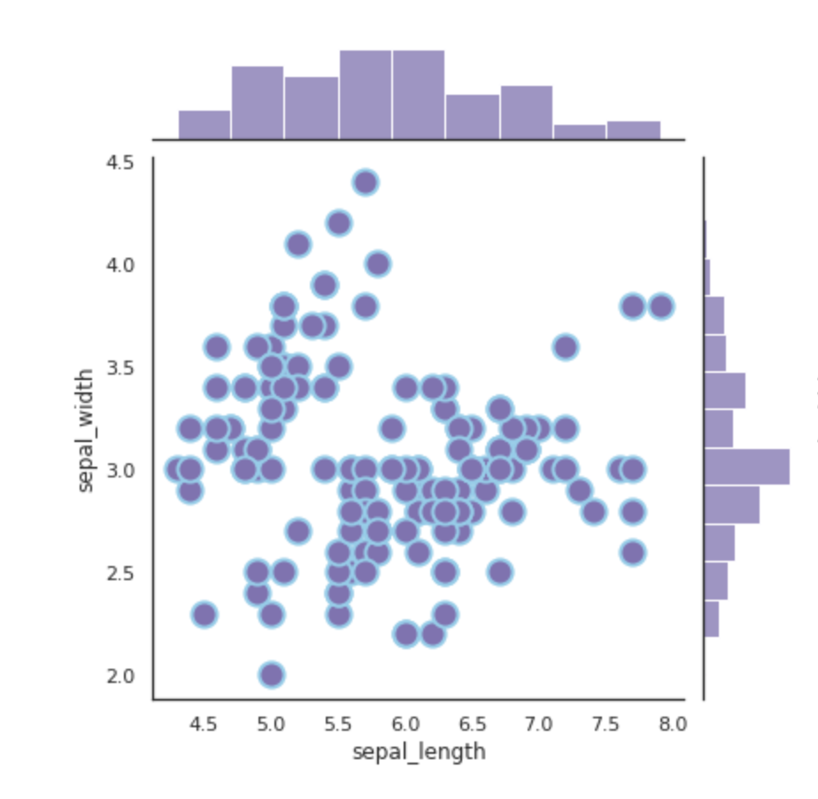

# ミーティングのメモ

## 230713

- Perplexityでちょっとわからないところがあったので聞いてみた
- [How do I get the PMC ID and the paper's title associated with it using the NCBI API?](https://www.perplexity.ai/search/7ee30316-65c5-4ad1-b6da-2520a63dee50?s=u)

```python

from Bio import Entrez

# メールアドレスを設定
Entrez.email = "your.email@example.com"

# 検索クエリを作成
search_term = "your search term here"

# 検索を実行
handle = Entrez.esearch(db="pmc", term=search_term)

# 検索結果を解析
record = Entrez.read(handle)

# PMC IDを取得
pmc_id = record["IdList"][0]

# PMC IDを使用して論文のメタデータを取得
handle = Entrez.esummary(db="pmc", id=pmc_id)
record = Entrez.read(handle)

# 論文のタイトルを取得
title = record[0]["Title"]

```

## 230707

- 一つの処理を一つの関数にブチ込めるようにアクティビティ図を完成させる
- 差分をとってくる処理をわかりやすく書く
- API 周りの設計図は鈴木さんを参考に
- メモ：繰り返し処理を後で追加

&nbsp;

### 1. どのような情報を取得するのかを決める(優先)

- メタデータに詳細な記述がない情報を取得したい
- 処理温度､処理時間､処理(incubator, water bath, fieldなど)
- この前ちらっと考えていたこと:処理温度と処理時間の散布図を作りたい
- [Marginal Plot with Seaborn](https://python-graph-gallery.com/82-marginal-plot-with-seaborn/)
- 

&nbsp;

### 2. どのような処理を行うのか

Eーdirectに変更
研究で使うならGPT使わないほうが良い?
どういうattributionが欲しいのか